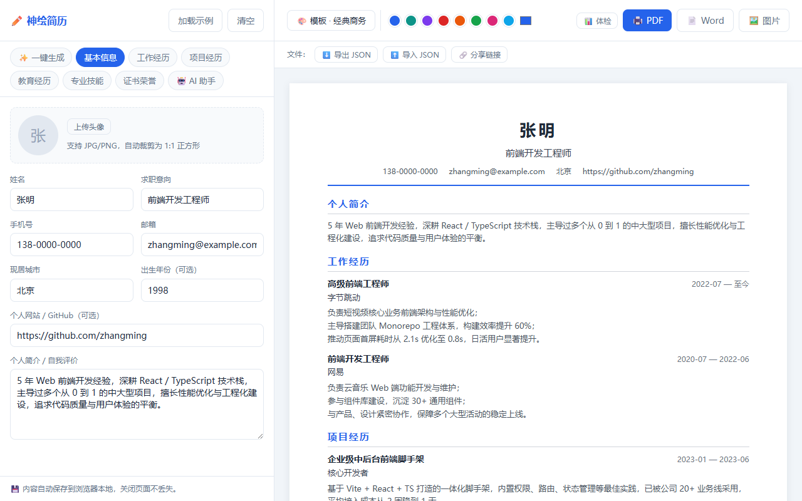
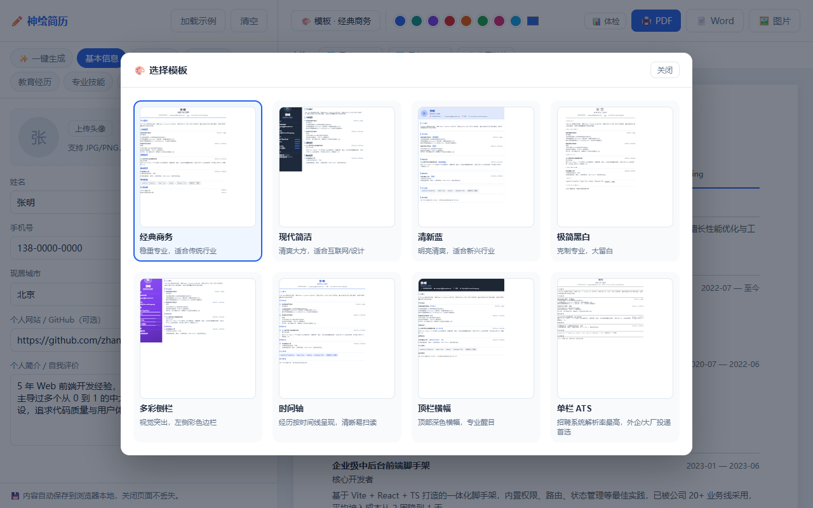

# ✏️ 神绘简历

[](https://opensource.org/licenses/MIT)

在线自动生成简历的网站：填写信息 → 选择模板 → 实时预览 → 一键导出 PDF/Word，AI 助手可帮你润色/扩写内容（DeepSeek）。

> 🚀 开源项目！欢迎 Star、Fork、提 Issue 或贡献代码（见 [CONTRIBUTING.md](CONTRIBUTING.md)）。

## 🖼️ 界面预览





## ✨ 功能特性

- **表单填写**：基本信息 / 工作经历 / 项目经历 / 教育经历 / 专业技能 / 证书荣誉
- **多模板切换**：8 套模板（经典商务 / 现代简洁 / 清新蓝 / 极简黑白 / 多彩侧栏 / 时间轴 / 顶栏横幅 / 单栏 ATS），**模板库带实时缩略图预览**，注册表易扩展
- **自定义主题色**：8 个预设色 + 自定义取色器 + 一键恢复默认，各模板主色实时跟随
- **头像上传**：自动 1:1 居中裁剪，各模板均可展示
- **实时预览**：左侧编辑、右侧所见即所得
- **导出**：PDF（浏览器打印，中文质量最佳）、Word（.docx，按需加载不拖慢页面）、PNG 图片、JSON 数据文件
- **导入 / 分享**：导入 JSON 恢复简历；生成压缩分享链接（URL hash，不含头像）
- **自动保存**：内容实时存入浏览器 localStorage，刷新不丢失
- **✨ 一键生成**：填求职意向 + 描述几句经历 → AI 产出完整简历草稿；或粘贴旧简历文本自动解析；或一键加载热门岗位示例（前端/产品/运营/销售/会计/HR）
- **新手向导**：首次使用 3 步引导（求职意向 → 内容来源 → 生成/示例），小白零门槛上手
- **简历体检**：本地规则即时评分（完整性 / 量化成果 / ATS），附逐项改进建议
- **共享 AI Key**（可选）：server.mjs 配置 `DEEPSEEK_API_KEY` 后，所有访问者无需自备 Key 即可用 AI
- **AI 助手**（可选）：DeepSeek 官方 API —— 润色个人简介 / 扩写工作与项目经历 / 生成技能建议 / 写求职信 / 全文优化建议
- **部署简单**：纯静态构建产物，或单文件 Node 服务一键运行

## 🚀 快速开始

> ⚠️ **AI 功能需要 DeepSeek API Key**：自行部署时在 server.mjs 配置 `DEEPSEEK_API_KEY`（所有访问者共享），
> 或由用户各自在「🤖 AI 助手」页填写自己的 Key。简历编辑/模板/导出等核心功能不依赖 AI。

### 开发模式

```bash
npm install
npm run dev        # 前端 Vite 开发服务器 http://localhost:5173
node server.mjs    # AI 代理服务（端口 3001，Vite 已配置 /api 代理）
```

### 生产部署（推荐，一条命令）

```bash
npm install
npm run build      # 生成静态产物 dist/
npm run serve      # 单文件服务：同源托管静态文件 + AI 代理
```

打开 http://localhost:3001 即可使用。**任何装有 Node.js 的环境都能跑**。

### 纯静态部署（不用 Node 服务）

`npm run build` 后把 `dist/` 目录拷到任意静态服务器（Nginx / 对象存储 / GitHub Pages / CDN）即可。
注意：纯静态模式下 AI 撰写不可用（浏览器无法直连 LLM API，CORS 限制），简历编辑/预览/导出功能不受影响。

## 🎨 使用 AI

### 方式一：网站已配置共享 Key（推荐公开部署）

启动服务时设置环境变量，所有访问者打开即用、无需任何配置：

```bash
DEEPSEEK_API_KEY=sk-xxx npm run serve
```

### 方式二：用户自带 Key

未配置共享 Key 时，用户到「🤖 AI 助手」页填写自己的 [DeepSeek API Key](https://platform.deepseek.com/)（仅存浏览器本地）。

### AI 能力一览

- **✨ 一键生成**：描述经历 → 完整简历草稿；粘贴旧简历 → 自动解析重构
- **🤖 AI 助手**：润色简介 / 扩写工作与项目经历 / 生成技能建议 / 写求职信 / 全文优化建议
- 所有 AI 请求经同源 `/api/ai` 代理转发，默认模型 `deepseek-chat`

## 📁 项目结构

```
shenghui-resume/
├── server.mjs              # 单文件部署服务（静态托管 + AI 代理）
├── index.html
├── src/
│   ├── main.tsx / App.tsx
│   ├── types/resume.ts     # 简历数据模型
│   ├── store/              # Zustand 全局状态（localStorage 持久化）
│   ├── data/               # 示例数据、模板注册表
│   ├── components/
│   │   ├── editor/         # 表单编辑区（各 section 表单 + AI 助手）
│   │   ├── templates/      # 模板渲染器（新增模板在此注册）
│   │   └── PreviewPanel.tsx
│   ├── utils/ai.ts         # DeepSeek 调用封装
│   └── styles/             # 全局样式 + 打印样式（PDF 导出）
```

## 🧩 新增模板

1. 在 `src/components/templates/` 新建模板组件（接收 `resume: ResumeData`）
2. 在 `src/data/templates.ts` 的 `templates` 数组注册 `{ id, name, desc, component }`
3. 模板样式加进 `global.css`，注意打印兼容（`break-inside: avoid`）

## 🔧 环境变量（server.mjs）

| 变量 | 默认值 | 说明 |
|---|---|---|
| `PORT` | `3001` | 服务端口 |
| `DEEPSEEK_BASE_URL` | `https://api.deepseek.com` | DeepSeek API 地址（可换兼容端点） |
| `DEEPSEEK_API_KEY` | （空） | 配置后为共享 Key：所有访问者无需自备 Key 即可使用 AI 功能 |

## ⚠️ 说明

- 用户自带 Key 模式：Key 存于浏览器 localStorage；共享 Key 模式：Key 只存在于服务器环境变量
- 简历数据仅存本地浏览器，不上传任何服务器
- 「极简黑白」「单栏 ATS」模板为保持 ATS 友好刻意不随主题色变化
